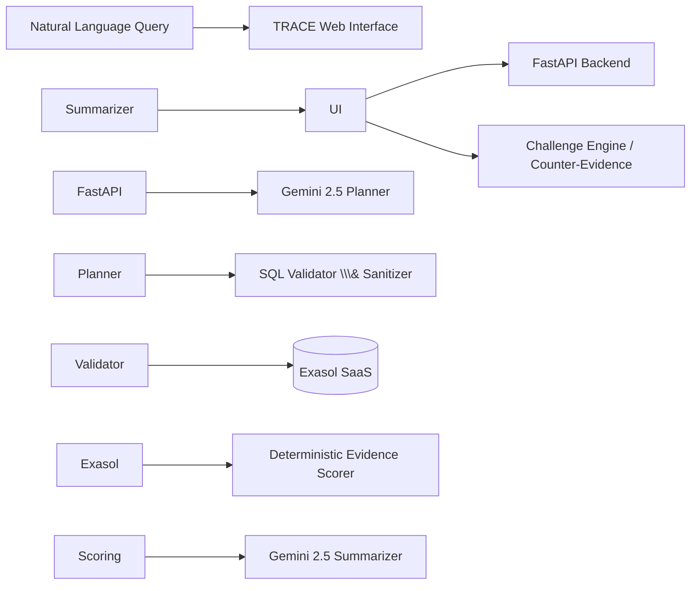

# TRACE: Evidence-First AI Decision Intelligence

> TRACE transforms business inquiries into transparent, verifiable analytics by generating competing hypotheses, executing high-speed ANSI SQL queries directly against Exasol SaaS, calculating deterministic evidence scores, and synthesizing audit-ready root causes with instant counter-evidence verification.

## The Problem

Traditional Business Intelligence tools and text-to-SQL assistants often produce static conclusions without providing enough verifiable context.

When important business metrics fluctuate, operators need to know **why** not just what happened. Black-box AI conclusions can make root-cause analysis difficult to verify and can introduce confirmation bias or hallucinated explanations.

## The Solution

**TRACE** is an evidence-first decision intelligence agent designed to turn natural-language business questions into transparent, verifiable investigations.

### Core Capabilities

* **Multi-Hypothesis Planning**  
Deconstructs high-level business questions into competing diagnostic hypotheses using Google Gemini.
* **High-Performance Exasol Execution**  
Generates and executes schema-aware ANSI SQL queries directly against Exasol SaaS using PyExasol.
* **Transparent Evidence Chain**  
Exposes the SQL query, returned data, and row previews behind every evidence node.
* **Challenge My Conclusion**  
Tests alternative explanations and counter-signals to re-evaluate confidence and reduce confirmation bias.

\---

## System Architecture



### Investigation Pipeline

#### 1\. Deconstruction

Gemini interprets the user's natural-language question, extracts relevant intents and temporal ranges, and generates competing hypotheses.

#### 2\. Dynamic Querying

TRACE generates schema-aware ANSI SQL queries against the Exasol `MAIN` schema.

The investigation can analyze tables such as:

* `ORDERS`
* `PAYMENT_LOGS`
* `FULFILLMENT_LOGS`
* `INVENTORY`

#### 3\. Evidence Execution

PyExasol executes the generated queries against Exasol and retrieves the resulting evidence.

Each hypothesis can therefore be supported or weakened by actual database results.

#### 4\. Deterministic Scoring

TRACE calculates evidence confidence using a deterministic scoring algorithm rather than relying solely on an LLM-generated confidence value.

#### 5\. Counter-Evidence

Operators can challenge a conclusion and ask TRACE to investigate alternative explanations, seasonal trends, or secondary anomalies.

\---

## Core Data Schema

The primary Exasol schema is `MAIN`.

|Table|Description|Key Attributes|
|-|-|-|
|`ORDERS`|Transaction records and conversion health|`ORDER_ID`, `USER_ID`, `CATEGORY`, `DEVICE_TYPE`, `AMOUNT`, `STATUS`, `CREATED_AT`|
|`PAYMENT\\\_LOGS`|Gateway latency and payment error diagnostics|`LOG_ID`, `ORDER_ID`, `GATEWAY`, `STATUS_CODE`, `ERROR_CODE`, `LATENCY_MS`|
|`FULFILLMENT\\\_LOGS`|Shipping and logistics performance|`FULFILLMENT_ID`, `ORDER_ID`, `WAREHOUSE_ID`, `CARRIER`, `DELAY_DAYS`, `STATUS`|
|`INVENTORY`|Product catalog and stock availability|`PRODUCT_ID`, `PRODUCT_NAME`, `CATEGORY`, `STOCK_QUANTITY`, `LAST_UPDATED`|

\---

## Key Features

### Deterministic Confidence Scoring

TRACE produces a **0–100% evidence score** based on measurable signals and predefined scoring logic rather than arbitrary model-generated confidence.

### Auditable Evidence

Every evidence node can expose:

* Generated SQL
* Query results
* Relevant data rows
* Evidence score
* Hypothesis being tested

This makes the reasoning process inspectable.

### Live Schema Introspection

TRACE can discover database metadata and map analytical queries to the available Exasol schema.

### Active Counter-Analysis

The **Challenge My Conclusion** engine actively searches for alternative explanations and confounding variables instead of simply reinforcing the initial hypothesis.

\---

##  Quickstart

### 1\. Clone the Repository

```bash
git clone https://github.com/vineet-b23/exasol-hackathon-trace.git
cd exasol-hackathon-trace
```

### 2\. Configure Environment Variables

Create a `.env` file in the project root:

```env
EXASOL_HOST=your_exasol_host:8563
EXASOL_USER=your_exasol_user
EXASOL_PASSWORD=your_exasol_password
EXASOL_SCHEMA=MAIN
GEMINI_API_KEY=your_gemini_api_key
```

> ⚠️ Never commit `.env` files, API keys, passwords, or database credentials to GitHub.

### 3\. Backend Setup

Create and activate a Python virtual environment:

```bash
python -m venv .venv
```

#### Windows

```bash
.venv\Scripts\activate
```

#### macOS / Linux

```bash
source .venv/bin/activate
```

Install dependencies:

```bash
pip install -r requirements.txt
```

Start the FastAPI server:

```bash
uvicorn backend.main:app --reload --port 8000
```

### 4\. Seed the Exasol Dataset

```bash
python backend/db/seed_exasol.py
```

### 5\. Run the Frontend

Open the frontend application in your browser or serve it using a local development server.

\---

## Tech Stack

|Layer|Technology|
|-|-|
|**Database**|Exasol SaaS|
|**AI Model**|Google Gemini 2.5 Flash|
|**AI SDK**|Google GenAI SDK|
|**Backend**|FastAPI|
|**Database Driver**|PyExasol|
|**Validation**|Pydantic|
|**Frontend**|Vanilla JavaScript|
|**Visualization**|SVG|
|**Backend Hosting**|Render|
|**Frontend Hosting**|GitHub Pages|
|**Version Control**|Git \& GitHub|

\---

## Security Considerations

TRACE is designed with security and auditability in mind.

* Database credentials are stored through environment variables.
* API keys are never hard-coded into source code.
* SQL queries are validated and sanitized before execution.
* Evidence is derived from actual database results.
* AI-generated conclusions are supported by deterministic evidence scoring.

\---

##  Demo

Add your project demonstration video or deployment URL here.

```text
Live Demo: https://vineet-b23.github.io/exasol-hackathon-trace/ (kindly be patient with the first query as the backend goes to sleep after inactivity)
Demo Video: https://www.youtube.com/watch?v=MTXS6db0A8A
```

\---

## Screenshots

Add screenshots of the TRACE interface here.


\---

##  Why TRACE?

Most AI analytics systems focus on producing **answers**.

TRACE focuses on producing **evidence-backed answers**.

The core philosophy is:

```text
Question
   ↓
Competing Hypotheses
   ↓
SQL Evidence
   ↓
Exasol Execution
   ↓
Deterministic Scoring
   ↓
Root Cause
   ↓
Counter-Evidence
   ↓
Auditable Decision
```

This allows business operators to move from:

> "The AI says this is the problem.

to:

> "Here is the hypothesis, here is the SQL, here is the data, here is the evidence score, and here is what happens when we challenge the conclusion."

\---

## Team

**Exasol Hackathon Team**

* Vineet B
* Vikhraman G S
* Manish N

\---

## License

This project was developed as part of the **Exasol Hackathon**.

